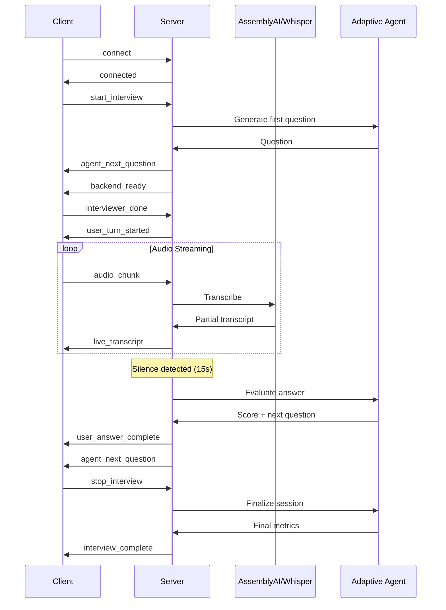

## Overview

The WebSocket API enables real-time voice interviews with live transcription, using Socket.IO for bidirectional communication between client and server.

<Note>
  WebSocket connections use the Socket.IO protocol. Install `socket.io-client` in your frontend.
</Note>

---

## Connection Setup

### Installation

```bash npm
npm install socket.io-client
```

### Basic Connection

```javascript
import io from 'socket.io-client';

const socket = io('http://localhost:5000', {
  transports: ['websocket'],
  reconnection: true
});

socket.on('connect', () => {
  console.log('Connected to server:', socket.id);
});

socket.on('disconnect', () => {
  console.log('Disconnected from server');
});
```

---

## Events Reference

### Client → Server Events

#### `start_interview`

Initialize a live interview session with adaptive question generation.

```javascript
socket.emit('start_interview', {
  user_id: 123,
  stress_test: false  // Set true for curveball questions
});
```

**Parameters:**

| Field | Type | Required | Description |
|-------|------|----------|-------------|
| `user_id` | integer | Yes | Authenticated user ID |
| `stress_test` | boolean | No | Enable curveball/stress mode (default: false) |

**Response Events:**
- `agent_next_question` - First interview question
- `backend_ready` - Server ready to receive audio

---

#### `interviewer_done`

Signal that interviewer has finished speaking and user's turn begins.

```javascript
socket.emit('interviewer_done', {
  user_id: 123
});
```

**Response Events:**
- `user_turn_started` - User can now speak
- Starts silence detection timer

---

#### `audio_chunk`

Stream audio data in real-time for transcription and analysis.

```javascript
// Send audio chunk (1-second intervals recommended)
socket.emit('audio_chunk', {
  user_id: 123,
  audio_data: base64AudioData,  // Base64-encoded PCM
  sample_rate: 16000
});
```

**Parameters:**

| Field | Type | Required | Description |
|-------|------|----------|-------------|
| `user_id` | integer | Yes | User ID |
| `audio_data` | string | Yes | Base64-encoded audio (16-bit PCM) |
| `sample_rate` | integer | Yes | Sample rate (16000 Hz recommended) |

**Audio Format:**
- **Encoding**: 16-bit PCM
- **Sample Rate**: 16kHz
- **Channels**: Mono (1 channel)
- **Chunk Duration**: 1 second (16000 samples)

**Response Events:**
- `live_transcript` - Real-time partial transcription
- Voice activity updates metrics

---

#### `stop_interview`

End the interview session and receive final analysis.

```javascript
socket.emit('stop_interview', {
  user_id: 123
});
```

**Response Events:**
- `interview_complete` - Final results and metrics

---

#### `leave_interview`

Cleanup and leave the interview room.

```javascript
socket.emit('leave_interview', {
  user_id: 123
});
```

---

### Server → Client Events

#### `connected`

Connection confirmation.

```javascript
socket.on('connected', (data) => {
  console.log('Status:', data.status);
});
```

**Payload:**
```json
{
  "status": "success"
}
```

---

#### `backend_ready`

Server is ready to receive audio chunks.

```javascript
socket.on('backend_ready', (data) => {
  console.log('Backend ready at:', data.timestamp);
  // Start sending audio chunks
});
```

**Payload:**
```json
{
  "status": "ready",
  "timestamp": 1709478123.456
}
```

---

#### `agent_next_question`

Next interview question from adaptive agent.

```javascript
socket.on('agent_next_question', (data) => {
  console.log('Question:', data.question);
});
```

**Payload:**
```json
{
  "question": "Can you explain the difference between synchronous and asynchronous programming?"
}
```

---

#### `live_transcript`

Real-time partial transcription updates.

```javascript
socket.on('live_transcript', (data) => {
  updateTranscriptUI(data.text);
});
```

**Payload:**
```json
{
  "text": "So asynchronous programming allows..."
}
```

<Info>
  Transcription uses browser SpeechRecognition API for ultra-low latency (&lt;200ms).
</Info>

---

#### `user_answer_complete`

User's answer has been processed and evaluated.

```javascript
socket.on('user_answer_complete', (data) => {
  console.log('Answer:', data.answer);
  console.log('Next question:', data.next_question);
});
```

**Payload:**
```json
{
  "answer": "Asynchronous programming allows multiple tasks...",
  "question": "Can you explain the difference between sync and async?",
  "next_question": "How would you handle async errors in Python?"
}
```

---

#### `timer_update`

Interview timer and turn time updates.

```javascript
socket.on('timer_update', (data) => {
  updateTimer(data.time_remaining);
  updateTurnTimer(data.turn_time_elapsed);
});
```

**Payload:**
```json
{
  "time_remaining": 1680,
  "turn_time_elapsed": 8.3
}
```

---

#### `interview_complete`

Final interview results with comprehensive metrics.

```javascript
socket.on('interview_complete', (data) => {
  displayResults(data);
});
```

**Payload:**
```json
{
  "success": true,
  "processing_method": "research_grade_event_driven",
  "transcript": "Full interview transcript...",
  "conversation": "Q: Question 1\n\nA: Answer 1\n\n...",
  "semantic_similarity": 0.78,
  "analysis_valid": true,
  "total_duration": 1245.6,
  "speaking_time": 812.3,
  "total_words": 987,
  "metrics": {
    "session_duration": 1245.6,
    "effective_duration": 1200.0,
    "speaking_time": 812.3,
    "silence_time": 387.7,
    "forced_silence_time": 45.6,
    "speaking_ratio": 0.652,
    "wpm": 145.2,
    "total_words": 987,
    "avg_pause_duration": 1.8,
    "pause_count": 34,
    "long_pause_count": 5,
    "hesitation_rate": 0.12,
    "articulation_rate": 3.2,
    "fluency_score": 0.82,
    "avg_response_latency": 2.1,
    "avg_semantic_similarity": 0.78,
    "avg_keyword_coverage": 0.65,
    "questions_answered": 8
  },
  "qa_pairs": [
    {
      "question": "Explain SOLID principles",
      "answer": "SOLID is an acronym...",
      "expected_answer": "SOLID principles include...",
      "similarity": 0.85,
      "keyword_coverage": 0.72
    }
  ]
}
```

---

#### `interview_error`

Error occurred during interview processing.

```javascript
socket.on('interview_error', (data) => {
  console.error('Interview error:', data.error);
});
```

**Payload:**
```json
{
  "error": "Transcription service unavailable"
}
```

---

## Real-Time Transcription Flow

### Architecture



### Live Transcription Pipeline

1. **Browser Capture** (Client)
   - MediaRecorder captures audio at 16kHz PCM
   - 1-second chunks sent via WebSocket

2. **Real-Time Processing** (Server)
   - Voice Activity Detection (VAD)
   - Browser SpeechRecognition for live captions (&lt;200ms)
   - Metrics tracking (speech time, pauses, WPM)

3. **Final Analysis** (Server)
   - Whisper transcription for accuracy
   - Semantic similarity scoring
   - Comprehensive speech metrics

---

## Complete Example

```javascript
import io from 'socket.io-client';

class LiveInterview {
  constructor(userId) {
    this.userId = userId;
    this.socket = io('http://localhost:5000');
    this.setupListeners();
  }

  setupListeners() {
    this.socket.on('connected', () => {
      console.log('Connected to interview server');
    });

    this.socket.on('backend_ready', () => {
      console.log('Server ready - start speaking');
      this.startAudioCapture();
    });

    this.socket.on('agent_next_question', (data) => {
      console.log('Question:', data.question);
      this.displayQuestion(data.question);
    });

    this.socket.on('live_transcript', (data) => {
      this.updateTranscript(data.text);
    });

    this.socket.on('user_answer_complete', (data) => {
      console.log('Answer evaluated:', data.answer);
    });

    this.socket.on('interview_complete', (data) => {
      console.log('Final score:', data.metrics.avg_semantic_similarity);
      this.displayResults(data);
    });
  }

  startInterview(stressMode = false) {
    this.socket.emit('start_interview', {
      user_id: this.userId,
      stress_test: stressMode
    });
  }

  notifyInterviewerDone() {
    this.socket.emit('interviewer_done', {
      user_id: this.userId
    });
  }

  async startAudioCapture() {
    const stream = await navigator.mediaDevices.getUserMedia({ audio: true });
    const mediaRecorder = new MediaRecorder(stream);

    mediaRecorder.ondataavailable = (event) => {
      const reader = new FileReader();
      reader.onloadend = () => {
        const base64Audio = reader.result.split(',')[1];
        this.socket.emit('audio_chunk', {
          user_id: this.userId,
          audio_data: base64Audio,
          sample_rate: 16000
        });
      };
      reader.readAsDataURL(event.data);
    };

    mediaRecorder.start(1000); // 1-second chunks
    this.mediaRecorder = mediaRecorder;
  }

  stopInterview() {
    if (this.mediaRecorder) {
      this.mediaRecorder.stop();
    }
    this.socket.emit('stop_interview', {
      user_id: this.userId
    });
  }

  displayQuestion(question) {
    // Update UI with question
  }

  updateTranscript(text) {
    // Update live transcript UI
  }

  displayResults(data) {
    // Show final interview results
  }
}

// Usage
const interview = new LiveInterview(123);
interview.startInterview();
```

---

## Speech Metrics Explained

| Metric | Description | Good Range |
|--------|-------------|------------|
| **WPM** | Words per minute | 120-160 |
| **Speaking Ratio** | % of time speaking vs total | 0.5-0.7 |
| **Fluency Score** | Overall fluency (0-1) | &gt;0.75 |
| **Articulation Rate** | Syllables per second | 3-5 |
| **Long Pause Count** | Pauses &gt;5 seconds | &lt;5 |
| **Response Latency** | Avg time to start answering | &lt;3s |
| **Semantic Similarity** | Answer quality vs expected | &gt;0.7 |
| **Keyword Coverage** | Key term usage | &gt;0.6 |

---

## Error Handling

```javascript
socket.on('interview_error', (data) => {
  console.error('Error:', data.error);
  // Handle error gracefully
});

socket.on('disconnect', () => {
  console.log('Disconnected - attempting reconnect');
});

socket.on('connect_error', (error) => {
  console.error('Connection error:', error);
});
```

---

## Best Practices

<CardGroup cols={2}>
  <Card title="Audio Quality" icon="microphone">
    - Use 16kHz sample rate
    - Send 1-second chunks
    - 16-bit PCM encoding
    - Mono audio only
  </Card>
  
  <Card title="Connection Management" icon="network-wired">
    - Enable reconnection
    - Handle disconnect events
    - Clean up on unmount
    - Use transports: ['websocket']
  </Card>
  
  <Card title="User Experience" icon="user">
    - Show live transcription
    - Display timer updates
    - Indicate turn status
    - Provide audio feedback
  </Card>
  
  <Card title="Error Recovery" icon="triangle-exclamation">
    - Retry on connection loss
    - Fallback to batch mode
    - Validate audio before send
    - Log errors for debugging
  </Card>
</CardGroup>
