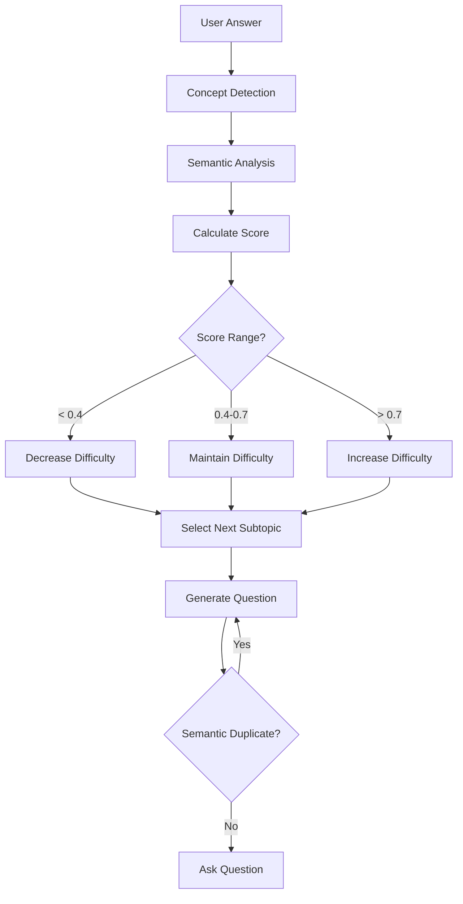

## Overview

The Adaptive Interview Engine dynamically adjusts question difficulty based on real-time performance analysis. It tracks concept mastery across sessions, manages subtopic progression, and implements semantic deduplication to ensure diverse question coverage.

**Source Files**:
- `backend/agent/adaptive_controller.py`
- `backend/agent/adaptive_analyzer.py`

## Core Architecture

### AdaptiveInterviewController

Central orchestration class managing session state, difficulty progression, and mastery tracking.

```python
class AdaptiveInterviewController:
    TOPICS = ["DBMS", "OS", "OOPS"]
    
    def __init__(self):
        self.sessions: Dict[str, AdaptiveInterviewState] = {}
        self.question_bank = AdaptiveQuestionBank()
        self.decision_engine = AdaptiveDecisionEngine()
        self.subtopic_trackers: Dict[int, SubtopicTracker] = {}
```
**Location**: `adaptive_controller.py:20-75`

## Difficulty Matrix (9-Case System)

Strict deterministic difficulty progression based on previous performance.

### Logic Rules

```python
def _calculate_next_difficulty(self, question_number: int, previous_score: float, previous_difficulty: str) -> str:
    """
    STRICT 9-CASE DIFFICULTY MATRIX
    
    Q1: Always MEDIUM
    
    Q2: Based on Q1 score:
        < 0.4  → EASY
        0.4-0.7 → MEDIUM
        > 0.7  → HARD
    
    Q3: Based on Q2 score:
        < 0.4  → EASY (regardless of previous)
        0.4-0.7 → MEDIUM (regardless of previous)
        > 0.7  → HARD (regardless of previous)
    """
    # Q1 always medium
    if question_number == 1:
        return "medium"
    
    # Q2 logic (based on Q1 score)
    if question_number == 2:
        if previous_score < 0.4:
            return "easy"
        elif previous_score > 0.7:
            return "hard"
        else:
            return "medium"
    
    # Q3 logic (based on Q2 score)
    if question_number == 3:
        if previous_score < 0.4:
            return "easy"
        elif previous_score > 0.7:
            return "hard"
        else:
            return "medium"
    
    return "medium"
```
**Location**: `adaptive_controller.py:30-69`

### Difficulty Transition Table

| Question | Previous Score | Next Difficulty |
|----------|----------------|------------------|
| Q1 | N/A | MEDIUM (baseline) |
| Q2 | < 0.4 | EASY (struggling) |
| Q2 | 0.4-0.7 | MEDIUM (adequate) |
| Q2 | > 0.7 | HARD (excelling) |
| Q3 | < 0.4 | EASY (needs support) |
| Q3 | 0.4-0.7 | MEDIUM (stable) |
| Q3 | > 0.7 | HARD (challenging) |

## Concept Mastery Tracking

### Concept Detection with Synonyms

```python
def _concept_in_answer(self, concept: str, answer_lower: str) -> bool:
    """
    Detect concept with synonym support
    """
    concept_lower = concept.lower()
    
    # Direct match
    if concept_lower in answer_lower:
        return True
    
    # Multi-word concept without spaces
    if ' ' in concept_lower:
        concept_no_space = concept_lower.replace(' ', '')
        answer_no_space = answer_lower.replace(' ', '')
        if concept_no_space in answer_no_space:
            return True
    
    # Synonym mapping
    synonyms = {
        'mutex': ['mutex', 'mutual exclusion', 'lock'],
        'semaphore': ['semaphore', 'counting semaphore', 'binary semaphore'],
        'critical section': ['critical section', 'critical region'],
        'deadlock': ['deadlock', 'deadly embrace'],
        'process': ['process', 'task'],
        'thread': ['thread', 'lightweight process'],
        'primary key': ['primary key', 'primary-key', 'pk'],
        'foreign key': ['foreign key', 'foreign-key', 'fk'],
        'avoidance': ['banker', 'safe state', 'avoidance'],
        'prevention': ['prevention', 'prevent'],
        'detection': ['detection', 'detect', 'wait-for graph']
    }
    
    if concept_lower in synonyms:
        for synonym in synonyms[concept_lower]:
            if synonym in answer_lower:
                return True
    
    return False
```
**Location**: `adaptive_controller.py:77-115`

### Semantic Concept Matching

Fallback to embedding-based similarity when exact matching fails.

```python
from sentence_transformers import SentenceTransformer
from sklearn.metrics.pairwise import cosine_similarity

_concept_embedder = SentenceTransformer("all-MiniLM-L6-v2")

def semantic_concept_match(answer: str, concept: str, threshold: float = 0.65):
    """Match concept using both exact and semantic similarity"""
    answer_norm = normalize_text(answer)
    concept_norm = normalize_text(concept)
    
    # Exact normalized match
    if concept_norm in answer_norm:
        print(f"   ✓ Exact match detected: {concept}")
        return True, 1.0
    
    # Semantic similarity
    answer_emb = _concept_embedder.encode([answer_norm], normalize_embeddings=True)[0]
    concept_emb = _concept_embedder.encode([concept_norm], normalize_embeddings=True)[0]
    
    similarity = cosine_similarity([answer_emb], [concept_emb])[0][0]
    
    print(f"   🔍 Concept similarity: {concept} → {similarity:.3f}")
    
    if similarity >= threshold:
        print(f"   ✓ Semantic match accepted: {concept}")
        return True, similarity
    
    return False, similarity
```
**Location**: `adaptive_analyzer.py:29-51`

### Text Normalization

```python
def normalize_text(text: str) -> str:
    """Normalize text for concept matching"""
    text = text.lower()
    text = text.replace("/", " ")
    text = text.replace("-", " ")
    text = re.sub(r'[^a-z0-9 ]', '', text)
    text = re.sub(r'\s+', ' ', text)
    return text.strip()
```
**Location**: `adaptive_analyzer.py:20-27`

## Subtopic Progression

### SubtopicTracker

Manages exactly 3 questions per subtopic, cycling through topics continuously.

**Key Invariants**:
1. Exactly 3 questions per subtopic
2. Round-robin topic rotation: DBMS → OS → OOPS → DBMS
3. Subtopic selection based on mastery gaps
4. No subtopic repetition within same session

### Session Initialization

```python
def start_session(self, session_id: str, user_id: int, user_name: str = "") -> dict:
    print("🎬 NEW ADAPTIVE INTERVIEW SESSION STARTED")
    print(f"   User ID:    {user_id}")
    print(f"   Session ID: {session_id}")
    
    # Load historical mastery data
    masteries = UserMastery.query.filter_by(user_id=user_id).all()
    
    state = AdaptiveInterviewState(
        session_id=session_id,
        user_id=user_id,
        user_name=user_name
    )
    
    # Restore mastery levels
    for m in masteries:
        mastery = state.ensure_topic_mastery(m.topic)
        mastery.mastery_level = m.mastery_level
        mastery.semantic_avg = m.semantic_avg
        mastery.keyword_avg = m.keyword_avg
        mastery.total_questions = m.questions_attempted
        mastery.sessions_attempted = getattr(m, 'sessions_attempted', 1)
        mastery.current_difficulty = m.current_difficulty
        mastery.consecutive_good = m.consecutive_good
        mastery.consecutive_poor = m.consecutive_poor
        mastery.mastery_velocity = m.mastery_velocity
        
        # Restore concept masteries
        concept_data = m.get_concept_masteries()
        for concept_name, cd in concept_data.items():
            concept = ConceptMastery.from_dict(cd)
            mastery.concept_masteries[concept_name] = concept
```
**Location**: `adaptive_controller.py:117-150`

## Semantic Deduplication

Prevents asking semantically similar questions within the same session.

### Deduplication Function

```python
from semantic_dedup import semantic_dedup

def semantic_dedup(asked_questions: List[str], candidate: str, threshold: float = 0.75) -> bool:
    """
    Returns True if candidate is semantically unique (NOT a duplicate)
    Returns False if candidate is too similar to any asked question
    """
    if not asked_questions:
        return True
    
    # Get embeddings
    embedder = SentenceTransformer("all-MiniLM-L6-v2")
    
    asked_embeddings = embedder.encode(asked_questions, normalize_embeddings=True)
    candidate_embedding = embedder.encode([candidate], normalize_embeddings=True)
    
    # Calculate similarities
    similarities = cosine_similarity(candidate_embedding, asked_embeddings)[0]
    max_similarity = np.max(similarities)
    
    print(f"   Max similarity: {max_similarity:.3f}")
    
    if max_similarity >= threshold:
        print(f"   ❌ Duplicate detected (similarity: {max_similarity:.3f})")
        return False
    
    print(f"   ✓ Unique question (similarity: {max_similarity:.3f})")
    return True
```

**Usage in Question Generation**:
```python
# Check if question is semantically unique
if not semantic_dedup(asked_questions, generated_question, threshold=0.75):
    print("Question too similar to previous, regenerating...")
    continue
```

## Learning Velocity

Tracks rate of mastery improvement across sessions.

### Velocity Calculation

```python
def calculate_mastery_velocity(current_mastery: float, last_mastery: float, sessions_gap: int = 1) -> float:
    """
    Calculate rate of mastery improvement
    Positive = improving, Negative = declining
    """
    if sessions_gap <= 0:
        return 0.0
    
    delta = current_mastery - last_mastery
    velocity = delta / sessions_gap
    
    return velocity
```

### Velocity-Based Interventions

```python
if mastery.mastery_velocity < -0.1:
    # Declining performance - adjust difficulty down
    print(f"⚠️ Declining velocity ({mastery.mastery_velocity:.3f}), easing difficulty")
    difficulty = "easy"
elif mastery.mastery_velocity > 0.15:
    # Rapid improvement - challenge more
    print(f"🚀 High velocity ({mastery.mastery_velocity:.3f}), increasing challenge")
    difficulty = "hard"
```

## AdaptiveAnalyzer

Enhanced analyzer providing adaptive learning signals.

### Technical Keywords by Topic

```python
class AdaptiveAnalyzer:
    TECH_KEYWORDS = {
        'DBMS': [
            'database', 'sql', 'query', 'index', 'transaction', 'acid', 
            'normalization', 'join', 'primary key', 'foreign key', 'schema', 
            'table', 'bcnf', '3nf', 'redundancy', 'anomaly', 'lock',
            'deadlock', 'concurrency', 'rollback', 'commit', 'logging'
        ],
        'OS': [
            'process', 'thread', 'memory', 'deadlock', 'scheduling', 
            'virtual memory', 'kernel', 'system call', 'context switch', 
            'semaphore', 'mutex', 'paging', 'segmentation', 'fifo', 'lru',
            'race condition', 'critical section', 'monitor', 'dining philosophers'
        ],
        'OOPS': [
            'class', 'object', 'inheritance', 'polymorphism', 'encapsulation', 
            'abstraction', 'interface', 'method', 'constructor', 'destructor',
            'overloading', 'overriding', 'virtual function', 'abstract class',
            'multiple inheritance', 'diamond problem', 'composition', 'aggregation'
        ]
    }
```
**Location**: `adaptive_analyzer.py:56-76`

### Depth & Confidence Indicators

```python
class AdaptiveAnalyzer:
    DEPTH_INDICATORS = [
        'because', 'therefore', 'thus', 'hence', 'consequently',
        'for example', 'for instance', 'specifically', 'in particular',
        'first', 'second', 'third', 'finally', 'additionally',
        'furthermore', 'moreover'
    ]
    
    CONFIDENT_INDICATORS = [
        'definitely', 'certainly', 'absolutely', 'clearly',
        'without doubt', 'undoubtedly', 'i know', 'i understand',
        'obviously', 'of course'
    ]
    
    HESITANT_INDICATORS = [
        'i think', 'maybe', 'perhaps', 'probably', 'i guess',
        'not sure', 'could be', 'might be', 'possibly',
        'sort of', 'kind of', 'approximately'
    ]
```
**Location**: `adaptive_analyzer.py:83-100`

### Depth Analysis

```python
def analyze_depth(answer: str) -> Dict[str, Any]:
    """
    Analyze answer depth using linguistic indicators
    """
    answer_lower = answer.lower()
    
    depth_count = sum(1 for indicator in DEPTH_INDICATORS if indicator in answer_lower)
    confident_count = sum(1 for indicator in CONFIDENT_INDICATORS if indicator in answer_lower)
    hesitant_count = sum(1 for indicator in HESITANT_INDICATORS if indicator in answer_lower)
    
    # Calculate depth score (0-1)
    depth_score = min(depth_count / 3, 1.0)  # Normalize to 0-1
    
    # Confidence score (-1 to 1)
    confidence_score = (confident_count - hesitant_count) / max(confident_count + hesitant_count, 1)
    
    return {
        'depth_score': depth_score,
        'confidence_score': confidence_score,
        'depth_indicators': depth_count,
        'confident_indicators': confident_count,
        'hesitant_indicators': hesitant_count
    }
```

## Adaptive Decision Flow



## Mastery Calculation

### Composite Score

```python
def calculate_composite_mastery(semantic_avg: float, keyword_avg: float, depth_score: float) -> float:
    """
    Composite mastery score combining multiple signals
    """
    weights = {
        'semantic': 0.5,
        'keyword': 0.3,
        'depth': 0.2
    }
    
    mastery = (
        semantic_avg * weights['semantic'] +
        keyword_avg * weights['keyword'] +
        depth_score * weights['depth']
    )
    
    return min(max(mastery, 0.0), 1.0)  # Clamp to [0, 1]
```

## Performance Metrics

### Key Metrics Tracked

| Metric | Purpose | Range |
|--------|---------|-------|
| Semantic Score | Answer relevance via embeddings | 0.0 - 1.0 |
| Keyword Score | Concept coverage | 0.0 - 1.0 |
| Depth Score | Explanation thoroughness | 0.0 - 1.0 |
| Confidence Score | Linguistic certainty | -1.0 - 1.0 |
| Mastery Level | Overall topic competence | 0.0 - 1.0 |
| Mastery Velocity | Learning rate | -1.0 - 1.0 |

## Configuration

```python
# Difficulty thresholds
EASY_THRESHOLD = 0.4
HARD_THRESHOLD = 0.7

# Semantic similarity thresholds
CONCEPT_MATCH_THRESHOLD = 0.65
DEDUPLICATION_THRESHOLD = 0.75

# Velocity thresholds
DECLINING_VELOCITY = -0.1
HIGH_VELOCITY = 0.15

# Questions per subtopic
QUESTIONS_PER_SUBTOPIC = 3
```

## Integration Points

- **RAG System**: Expected answer generation (`rag.py:agentic_expected_answer()`)
- **Question Bank**: Dynamic question retrieval with difficulty filtering
- **Database**: Persistent mastery storage (`UserMastery`, `SubtopicMastery` models)
- **Speech Processing**: Real-time metrics for adaptive scoring
