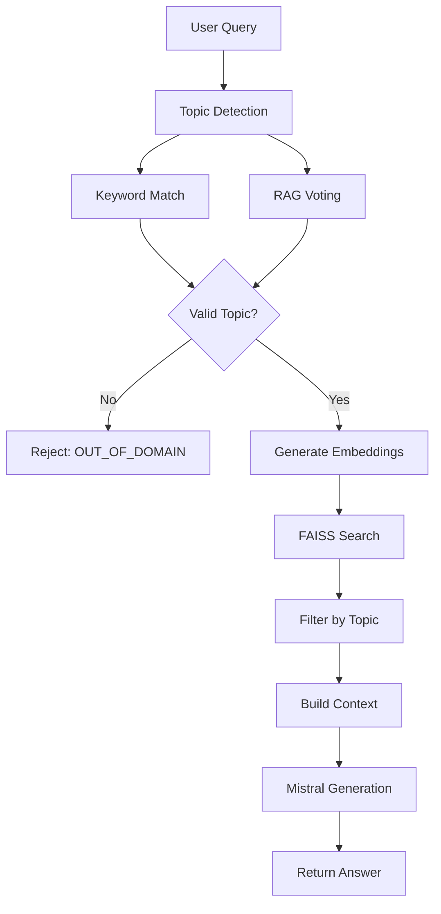

## Overview

The RAG (Retrieval-Augmented Generation) system combines semantic vector search with large language model generation to provide accurate, context-aware responses. The pipeline uses FAISS for efficient similarity search and Mistral API for high-quality text generation.

**Source File**: `backend/rag.py`

## Core Components

### 1. Topic Detection & Domain Restriction

The system enforces strict domain boundaries to ensure responses stay within allowed topics.

#### Allowed Topics
```python
ALLOWED_TOPICS = {"Operating Systems", "DBMS", "OOP"}
```

#### Topic Aliases
Normalizes variations of topic names to canonical forms:

```python
TOPIC_ALIASES = {
    # OS variations
    "OS": "Operating Systems",
    "Operating System": "Operating Systems",
    "os": "Operating Systems",
    
    # DBMS variations
    "DBMS": "DBMS",
    "Database": "DBMS",
    "dbms": "DBMS",
    
    # OOP variations
    "OOP": "OOP",
    "OOPS": "OOP",
    "Object Oriented Programming": "OOP",
}
```

**Location**: `rag.py:35-56`

#### Keyword-Based Topic Detection
```python
def get_topic_and_subtopic_from_query(query, topic_rules=None):
    if topic_rules is None:
        topic_rules = get_topic_rules()
    
    q = query.lower()
    for rule in topic_rules:
        for kw in rule["keywords"]:
            if kw in q:
                print(f"   Detected topic: {rule['topic']} -> {rule['subtopic']}")
                return rule["topic"], rule["subtopic"]
    return None, None
```
**Location**: `rag.py:133-143`

#### RAG Voting for Topic Detection
Uses majority voting from top-k retrieved chunks:

```python
def detect_topic_via_rag(query, k=5):
    # Get embedding
    query_emb = embedder.encode([query], normalize_embeddings=True)
    
    # Search
    scores, I = index.search(query_emb, k)
    
    # Count votes per topic (with normalization)
    normalized_votes = {}
    for idx in I[0]:
        if idx >= 0 and idx < len(metas):
            raw_topic = metas[idx].get("topic", "Unknown")
            normalized_topic = TOPIC_ALIASES.get(raw_topic, raw_topic)
            normalized_votes[normalized_topic] = normalized_votes.get(normalized_topic, 0) + 1
    
    # Get winner from normalized votes
    topic = max(normalized_votes, key=normalized_votes.get)
    confidence = normalized_votes[topic] / k
    
    return topic, confidence
```
**Location**: `rag.py:446-490`

### 2. Caching Architecture

The system implements global caching to avoid repeated model loading and data reads.

#### Cache Variables
```python
_INDEX_CACHE = None        # FAISS index
_METAS_CACHE = None        # Metadata for chunks
_KB_LOOKUP_CACHE = None    # Knowledge base lookup dict
_EMBEDDER_CACHE = None     # SentenceTransformer model
_TOPIC_RULES_CACHE = None  # Topic detection rules
```
**Location**: `rag.py:66-70`

#### Cached Embedder
```python
def get_embedder():
    """Get cached sentence transformer embedder"""
    global _EMBEDDER_CACHE
    if _EMBEDDER_CACHE is None:
        print("🔄 Loading sentence transformer model (cached)...")
        _EMBEDDER_CACHE = SentenceTransformer("all-MiniLM-L6-v2")
    return _EMBEDDER_CACHE
```
**Location**: `rag.py:74-80`

#### Cached Index & Metadata
```python
def load_index_and_metas():
    global _INDEX_CACHE, _METAS_CACHE
    
    if _INDEX_CACHE is None or _METAS_CACHE is None:
        print(f"📚 Loading FAISS index from {INDEX_PATH}")
        _INDEX_CACHE = faiss.read_index(INDEX_PATH)
        _METAS_CACHE = load_json(METAS_PATH)
        
        # Count topics for debugging
        topic_counts = {}
        for meta in _METAS_CACHE:
            topic = meta.get('topic', 'Unknown')
            topic_counts[topic] = topic_counts.get(topic, 0) + 1
        
        print(f"   Loaded {len(_METAS_CACHE)} total chunks")
    
    return _INDEX_CACHE, _METAS_CACHE
```
**Location**: `rag.py:98-117`

### 3. FAISS Retrieval

#### Strict Topic Filtering
```python
def get_relevant_chunks_strict(query, index, metas, model, topic=None, k=5):
    print(f"\n🔍 Searching for relevant chunks (k={k})...")
    
    query_embedding = model.encode([query], normalize_embeddings=True)
    scores, I = index.search(query_embedding, k * 8)  # Over-fetch for filtering
    
    results = []
    seen_ids = set()
    
    for idx, score in zip(I[0], scores[0]):
        if idx < 0 or idx >= len(metas):
            continue
        meta = metas[idx]
        
        # Filter by topic if specified
        if topic is not None and meta["topic"] != topic:
            continue
            
        # Deduplicate
        if meta["id"] in seen_ids:
            continue
        seen_ids.add(meta["id"])
        
        meta_copy = meta.copy()
        meta_copy["_score"] = float(score)
        results.append(meta_copy)
        
        if len(results) == k:
            break
    
    return results
```
**Location**: `rag.py:167-193`

#### Similar Q&A Retrieval
Retrieve few-shot examples for question generation:

```python
def retrieve_similar_qas(query, topic=None, k=3):
    # Load cached data
    index, metas = load_index_and_metas()
    kb_lookup = build_kb_lookup()
    embedder = get_embedder()
    
    # Normalize topic
    normalized_topic = TOPIC_ALIASES.get(topic, topic) if topic else None
    
    # Get embedding and search
    query_emb = embedder.encode([query], normalize_embeddings=True)
    scores, I = index.search(query_emb, k * 3)
    
    results = []
    seen_ids = set()
    
    for idx, score in zip(I[0], scores[0]):
        if idx < 0 or idx >= len(metas):
            continue
        
        meta = metas[idx]
        
        # Filter by topic if specified
        if normalized_topic and meta.get("topic") != normalized_topic:
            continue
        
        item_id = meta["id"]
        if item_id in seen_ids:
            continue
        
        seen_ids.add(item_id)
        item = kb_lookup.get(item_id, {})
        
        results.append({
            "id": item_id,
            "question": item.get("question", meta.get("text", ""))[:150],
            "answer": item.get("answer", ""),
            "topic": meta.get("topic"),
            "subtopic": meta.get("subtopic"),
            "score": float(score)
        })
        
        if len(results) >= k:
            break
    
    return results
```
**Location**: `rag.py:309-376`

### 4. Context Building

The system builds rich context from retrieved chunks before sending to the LLM.

```python
def technical_interview_query(user_query):
    # ... retrieval logic ...
    
    # Build context from retrieved chunks
    context_blocks = []
    for meta in retrieved:
        item = kb_lookup.get(meta["id"])
        if item and item.get("answer"):
            # Add topic marker to help LLM
            topic_marker = f"[{meta.get('topic')} - {meta.get('subtopic')}]"
            answer_text = item.get("answer", "")
            context_blocks.append(f"{topic_marker}\n{answer_text}")
    
    context_text = "\n\n".join(context_blocks)
    print(f"\n📚 Context built from {len(context_blocks)} chunks ({len(context_text)} chars)")
    
    return context_text
```
**Location**: `rag.py:617-627`

### 5. Mistral API Integration

#### Technical Explanation Generation
```python
def generate_technical_explanation(query, context, topic=None):
    # Normalize topic
    if topic:
        normalized_topic = TOPIC_ALIASES.get(topic, topic)
    else:
        normalized_topic = None
    
    # Strict domain enforcement
    if normalized_topic and normalized_topic not in ALLOWED_TOPICS:
        return OUT_OF_DOMAIN_MESSAGE
    
    prompt = f"""
You are an expert Computer Science educator providing a DETAILED explanation.

Topic: {normalized_topic if normalized_topic else 'Computer Science'}

RULES:
- Provide a THOROUGH, EDUCATIONAL explanation (4-6 sentences)
- ONLY discuss concepts from the specified topic
- DO NOT answer if topic is outside Operating Systems, DBMS, or OOP

Context from knowledge base:
{context}

Student Question: {query}

Detailed Educational Answer:
"""
    
    response = mistral_client.chat.complete(
        model=MISTRAL_MODEL,
        messages=[{"role": "user", "content": prompt}],
        temperature=0.3
    )
    
    answer = response.choices[0].message.content.strip()
    return answer
```
**Location**: `rag.py:197-255`

#### Interview Question Generation
```python
def generate_interview_question(prompt, topic=None):
    full_prompt = f"""{prompt}

CRITICAL INSTRUCTION:
- Return ONLY the question text
- NO introductions or commentary
- Maximum 400 characters

Question:"""
    
    response = mistral_client.chat.complete(
        model=MISTRAL_MODEL,
        messages=[{"role": "user", "content": full_prompt}],
        temperature=0.3
    )
    
    question = response.choices[0].message.content.strip()
    return question
```
**Location**: `rag.py:280-305`

#### Expected Answer Generation (Adaptive Interviews)
```python
def agentic_expected_answer(user_query, sampled_concepts=None, expected_topic=None):
    # Normalize topic
    normalized_topic = TOPIC_ALIASES.get(expected_topic, expected_topic)
    
    # Retrieve topic-specific chunks
    chunks = retrieve_relevant_chunks(user_query, k=5, topic=normalized_topic)
    chunks = [c for c in chunks if c.get("topic") == normalized_topic]
    
    # Build context
    context_blocks = [chunk.get("answer", chunk.get("text", "")) for chunk in chunks]
    concept_list = ", ".join(sampled_concepts) if sampled_concepts else "key concepts"
    
    context_text = f"""
Topic: {normalized_topic}
Required concepts: {concept_list}

Knowledge:
{chr(10).join(context_blocks[:3])}
"""
    
    prompt = f"""
You are an expert technical interviewer.

Generate a concise expected answer.

REQUIREMENTS:
• Length: 2-4 sentences
• Must mention ALL required concepts explicitly: {concept_list}
• Must use provided context only
• Must be technically accurate and precise

Topic: {normalized_topic}
Question: {user_query}

Relevant context:
{context_text}

Expected Answer:"""
    
    response = mistral_client.chat.complete(
        model=MISTRAL_MODEL,
        messages=[{"role": "user", "content": prompt}],
        temperature=0.2
    )
    
    answer = response.choices[0].message.content.strip()
    return answer, chunks
```
**Location**: `rag.py:642-750`

## Pipeline Flow

### Technical Interview Query



**Main Entry Point**: `rag.py:499-638`

## Configuration

### Paths
```python
FAISS_DIR = "data/processed/faiss_mistral"
INDEX_PATH = os.path.join(FAISS_DIR, "index.faiss")
METAS_PATH = os.path.join(FAISS_DIR, "metas.json")
KB_CLEAN_PATH = "data/processed/kb_clean.json"
TOPIC_RULES_PATH = "config/topic_rules.json"
```

### Mistral Client
```python
from mistralai import Mistral

MISTRAL_API_KEY = os.getenv("MISTRAL_API_KEY")
mistral_client = Mistral(api_key=MISTRAL_API_KEY)
MISTRAL_MODEL = "mistral-large-latest"
```
**Location**: `rag.py:16-20`

## Performance Optimizations

1. **Global Caching**: Models and indexes loaded once per process
2. **Normalized Embeddings**: Enables faster cosine similarity via inner product
3. **Over-fetching with Filtering**: Search k*8, filter down to k for topic relevance
4. **Deduplication**: Track seen IDs to prevent duplicate chunks in context

## Key Functions Summary

| Function | Purpose | Location |
|----------|---------|----------|
| `technical_interview_query()` | Main chatbot entry point | rag.py:499 |
| `detect_topic_via_rag()` | RAG voting for topic detection | rag.py:446 |
| `get_embedder()` | Get cached embedder | rag.py:74 |
| `load_index_and_metas()` | Load cached FAISS index | rag.py:98 |
| `retrieve_similar_qas()` | Get few-shot examples | rag.py:309 |
| `retrieve_relevant_chunks()` | Get context chunks | rag.py:379 |
| `agentic_expected_answer()` | Generate expected answers | rag.py:642 |
| `generate_technical_explanation()` | Generate educational responses | rag.py:197 |
| `generate_interview_question()` | Generate interview questions | rag.py:280 |
