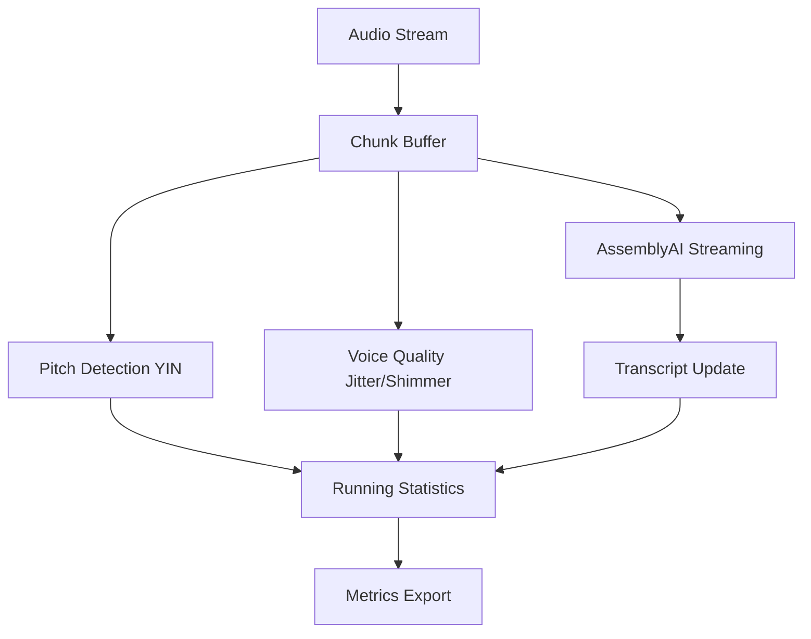

## Overview

The speech processing system analyzes audio streams in real-time to extract acoustic features, transcribe speech, and compute research-grade metrics for interview assessment.

**Source File**: `backend/interview_analyzer.py`

## Core Components

### 1. RunningStatistics Class

Central class for tracking speech metrics using Welford's online algorithm for numerical stability.

```python
class RunningStatistics:
    def __init__(self, pause_threshold=0.3, long_pause_threshold=5.0, ignore_long_pause_over=20.0):
        self.lock = threading.RLock()
        
        # Research-grade clocks
        self.session_start_time = now_ts()
        self.current_speech_start = None
        self.last_speech_end = None
        
        # Correct aggregates
        self.total_speaking_time = 0.0      # Actual voice activity
        self.total_silence_time = 0.0        # Pauses BETWEEN speech segments
        self.forced_silence_time = 0.0       # 15s waits AFTER answer complete
        
        # Pause tracking
        self.pause_threshold = float(pause_threshold)
        self.long_pause_threshold = float(long_pause_threshold)
        self.pause_durations = []
        self.long_pause_count = 0
```
**Location**: `interview_analyzer.py:29-72`

#### Key Design Principles

**Correct Speech Timing Logic**:
- `speaking_time` = actual voice activity duration
- `silence_time` = pauses BETWEEN speech segments (thinking time)
- `forced_silence_time` = 15s system waits AFTER answer complete
- `effective_duration` = total session time - forced silence

### 2. Welford's Online Algorithm

Implements numerically stable running mean and variance calculation without storing all samples.

#### Speech Event Tracking

```python
def record_speech_start(self, ts=None):
    """Called when user starts speaking"""
    with self.lock:
        ts = now_ts() if ts is None else ts
        
        # Detect pause before starting new speech (thinking time)
        if self.last_speech_end is not None:
            pause_duration = ts - self.last_speech_end
            if pause_duration > self.pause_threshold:
                # Only count reasonable pauses
                if pause_duration < self.ignore_long_pause_over:
                    self.pause_durations.append(pause_duration)
                    self.total_silence_time += pause_duration
                    
                    if pause_duration > self.long_pause_threshold:
                        self.long_pause_count += 1
        
        # Start new speech segment
        if self.current_speech_start is None:
            self.current_speech_start = ts
            
            # Record response latency
            if not self.first_voice_recorded and self.question_end_time is not None:
                latency = ts - self.question_end_time
                self.response_latencies.append(latency)
                self.first_voice_recorded = True
```
**Location**: `interview_analyzer.py:110-148`

```python
def record_speech_end(self, ts=None):
    """Called when user stops speaking"""
    with self.lock:
        ts = now_ts() if ts is None else ts
        
        if self.current_speech_start is None:
            return
        
        # Calculate speech duration for this segment
        speech_duration = ts - self.current_speech_start
        
        # Sanity check: cap unusual speaking times
        expected_speaking_time = self.total_words * 0.3  # 300ms per word
        if expected_speaking_time > 0 and speech_duration > expected_speaking_time * 2:
            speech_duration = min(speech_duration, expected_speaking_time * 1.5)
        
        self.total_speaking_time += speech_duration
        self.last_speech_end = ts
        self.current_speech_start = None
```
**Location**: `interview_analyzer.py:150-171`

### 3. Pitch Detection (YIN Algorithm)

Uses librosa's YIN implementation for robust fundamental frequency (F0) estimation.

```python
def analyze_audio_chunk_fast(audio_data, sr=16000, stats=None):
    """
    Real-time audio chunk analysis with pitch detection
    """
    # Convert to mono float32
    if audio_data.dtype != np.float32:
        audio_data = audio_data.astype(np.float32) / 32768.0
    
    if len(audio_data.shape) > 1:
        audio_data = np.mean(audio_data, axis=1)
    
    # Pitch detection using YIN algorithm
    f0 = librosa.yin(
        audio_data,
        fmin=75,      # Male voice lower bound
        fmax=400,     # Female voice upper bound
        sr=sr,
        frame_length=2048
    )
    
    # Filter valid pitch values
    valid_f0 = f0[(f0 > 0) & (f0 < 500)]
    
    if len(valid_f0) > 0:
        pitch_mean = np.mean(valid_f0)
        pitch_std = np.std(valid_f0)
        
        # Update running statistics with Welford's algorithm
        if stats:
            for p in valid_f0:
                stats.pitch_count += 1
                delta = p - stats.pitch_mean
                stats.pitch_mean += delta / stats.pitch_count
                delta2 = p - stats.pitch_mean
                stats.pitch_m2 += delta * delta2
                stats.pitch_min = min(stats.pitch_min, p)
                stats.pitch_max = max(stats.pitch_max, p)
    
    return {
        'pitch_mean': pitch_mean if len(valid_f0) > 0 else 0.0,
        'pitch_std': pitch_std if len(valid_f0) > 0 else 0.0,
    }
```

**YIN Algorithm Parameters**:
- `fmin=75`: Lower bound for male voices
- `fmax=400`: Upper bound for female voices
- `frame_length=2048`: Analysis window size
- Valid range filter: 0 < F0 < 500 Hz

### 4. Voice Quality Metrics

#### Jitter (Frequency Perturbation)

Measures cycle-to-cycle variation in pitch period.

```python
def calculate_jitter(audio, sr, f0_mean):
    """
    Jitter: Cycle-to-cycle variation in fundamental frequency
    """
    if f0_mean <= 0:
        return 0.0
    
    # Extract pitch periods
    pitch_periods = []
    zero_crossings = librosa.zero_crossings(audio, pad=False)
    
    periods = []
    for i in range(len(zero_crossings) - 1):
        if zero_crossings[i] and zero_crossings[i+1]:
            period = (i+1) - i
            periods.append(period)
    
    if len(periods) < 2:
        return 0.0
    
    # Calculate absolute differences
    jitter_values = []
    for i in range(len(periods) - 1):
        diff = abs(periods[i+1] - periods[i])
        jitter_values.append(diff)
    
    return np.mean(jitter_values) if jitter_values else 0.0
```

**Clinical Significance**:
- Normal jitter: < 1%
- Elevated jitter: May indicate vocal stress or nervousness
- Used in combination with shimmer for voice quality assessment

#### Shimmer (Amplitude Perturbation)

Measures cycle-to-cycle variation in amplitude.

```python
def calculate_shimmer(audio, sr):
    """
    Shimmer: Cycle-to-cycle variation in amplitude
    """
    # Extract amplitude envelope
    amplitude_envelope = np.abs(librosa.stft(audio))
    amplitude_envelope = np.mean(amplitude_envelope, axis=0)
    
    if len(amplitude_envelope) < 2:
        return 0.0
    
    # Calculate differences
    shimmer_values = []
    for i in range(len(amplitude_envelope) - 1):
        if amplitude_envelope[i] > 0:
            diff = abs(amplitude_envelope[i+1] - amplitude_envelope[i]) / amplitude_envelope[i]
            shimmer_values.append(diff)
    
    return np.mean(shimmer_values) if shimmer_values else 0.0
```

**Clinical Significance**:
- Normal shimmer: < 3.81%
- Elevated shimmer: May indicate vocal fatigue or stress

### 5. Faster-Whisper Integration

High-performance speech-to-text transcription using CTranslate2.

```python
from faster_whisper import WhisperModel

# Model initialization
whisper_model = WhisperModel(
    "base",              # Model size: tiny, base, small, medium, large
    device="cpu",        # Use "cuda" for GPU
    compute_type="int8"  # Quantization for speed
)

def transcribe_audio(audio_path):
    segments, info = whisper_model.transcribe(
        audio_path,
        beam_size=5,
        language="en",
        task="transcribe"
    )
    
    transcript = ""
    for segment in segments:
        transcript += segment.text + " "
    
    return transcript.strip()
```

**Performance Characteristics**:
- 4x faster than OpenAI Whisper
- Lower memory footprint via quantization
- Real-time capable on CPU

### 6. AssemblyAI Streaming

Real-time streaming transcription with speaker diarization support.

```python
import assemblyai as aai

aai.settings.api_key = os.getenv("ASSEMBLYAI_API_KEY")

def on_open(session_opened):
    print("Session opened")

def on_data(transcript):
    if not transcript.text:
        return
    
    if isinstance(transcript, aai.RealtimeFinalTranscript):
        # Update running statistics
        stats.update_transcript(transcript.text)
        print(f"Final: {transcript.text}")
    else:
        # Interim transcript
        print(f"Interim: {transcript.text}")

def on_error(error):
    print(f"Error: {error}")

def on_close():
    print("Session closed")

# Create streaming transcriber
transcriber = aai.RealtimeTranscriber(
    sample_rate=16000,
    on_data=on_data,
    on_error=on_error,
    on_open=on_open,
    on_close=on_close
)

# Start streaming
transcriber.connect()
transcriber.stream(audio_stream)
```

**Features**:
- Real-time streaming transcription
- Speaker diarization
- Automatic punctuation and capitalization
- Word-level timestamps

## Metric Calculation

### Response Latency

```python
def record_question_end(self, ts=None):
    """Called when interviewer finishes asking question"""
    with self.lock:
        ts = now_ts() if ts is None else ts
        self.question_end_time = ts
```

Latency measured as time from question end to first voice activity:

```python
if not self.first_voice_recorded and self.question_end_time is not None:
    latency = ts - self.question_end_time
    self.response_latencies.append(latency)
    self.first_voice_recorded = True
```
**Location**: `interview_analyzer.py:102-148`

### Speaking Rate (WPM)

```python
def calculate_speaking_rate(total_words, total_speaking_time):
    """Words per minute calculation"""
    if total_speaking_time <= 0:
        return 0.0
    
    wpm = (total_words / total_speaking_time) * 60
    return wpm
```

**Benchmarks**:
- Slow: < 120 WPM
- Normal: 120-160 WPM
- Fast: > 160 WPM

### Pause Analysis

```python
def analyze_pauses(pause_durations, long_pause_threshold=5.0):
    if not pause_durations:
        return {
            'avg_pause': 0.0,
            'max_pause': 0.0,
            'long_pauses': 0
        }
    
    long_pauses = [p for p in pause_durations if p > long_pause_threshold]
    
    return {
        'avg_pause': np.mean(pause_durations),
        'max_pause': np.max(pause_durations),
        'long_pauses': len(long_pauses)
    }
```

## Real-Time Processing Pipeline



## Thread Safety

All metric updates are protected by reentrant locks:

```python
self.lock = threading.RLock()

def record_speech_start(self, ts=None):
    with self.lock:
        # ... thread-safe updates ...
```

## Performance Optimizations

1. **Welford's Algorithm**: O(1) memory for variance calculation
2. **Monotonic Timestamps**: Use `time.monotonic()` for wall-clock independence
3. **Batch Processing**: Accumulate metrics, export periodically
4. **Normalized Audio**: Convert to float32 once, reuse

## Key Metrics Summary

| Metric | Formula | Clinical Range |
|--------|---------|----------------|
| Pitch (F0) | YIN algorithm | 75-400 Hz |
| Jitter | Cycle-to-cycle F0 variation | < 1% normal |
| Shimmer | Cycle-to-cycle amplitude variation | < 3.81% normal |
| Speaking Rate | (words / speaking_time) * 60 | 120-160 WPM |
| Response Latency | first_voice - question_end | < 2s optimal |
| Long Pauses | Pauses > 5s | 0-2 acceptable |

## Configuration

```python
# Pause thresholds
pause_threshold = 0.3          # Minimum pause to count (300ms)
long_pause_threshold = 5.0     # Long pause threshold (5s)
ignore_long_pause_over = 20.0  # Ignore system waits (20s)

# Audio parameters
sample_rate = 16000            # 16 kHz audio
frame_length = 2048            # YIN window size

# Pitch detection
fmin = 75                      # Male voice lower bound
fmax = 400                     # Female voice upper bound
```
